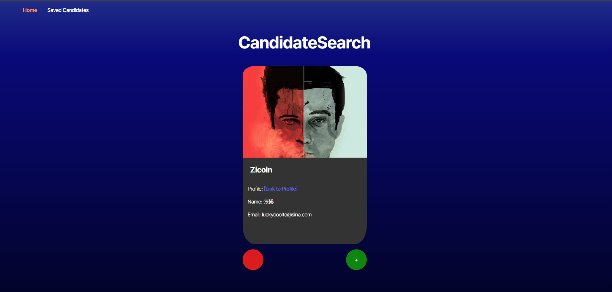

# GitHub Candidate Profiler


## Description

GitHub Candidate Profiler is a web application that allows users to review GitHub profiles and select potential candidates. Users can browse through profiles, accept candidates into a saved list, or skip to the next profile. The application is built with Vite, React, TypeScript, JavaScript, and CSS to deliver a fast and interactive experience.





## Table of Contents

- [GitHub Candidate Profiler](#github-candidate-profiler)
  - [Description](#description)
  - [Table of Contents](#table-of-contents)
  - [Installation](#installation)
  - [Usage](#usage)
  - [Features](#features)
  - [Technologies Used](#technologies-used)
  - [Contributing](#contributing)
  - [License](#license)
    - [Acknowledgments](#acknowledgments)
    - [Questions](#questions)
    - [Resources](#resources)

## Installation

1. Clone the repository:
   ```bash
   git clone https://github.com/savevsgames/GitHubCandidateProfiler.git
   ```
2. Install the dependencies:
   ```bash
   npm install
   ```
3. Start the development server:
   ```bash
   npm run dev
   ```

## Usage

- Visit the homepage to view a randomly selected GitHub candidate profile.
- Click the "+" button to save the current candidate to your list of potential candidates.
- Click the "-" button to skip the current candidate and view the next one.
- Visit the potential candidates page to view the list of saved candidates.

## Features

- View GitHub candidate profiles with key information such as:
  - Name
  - Username
  - Location
  - Avatar
  - Email
  - HTML URL
  - Company
- Save candidates to a list of potential candidates.
- Persist the list of saved candidates even after reloading the page.
- Navigate through candidate profiles with the "+" and "-" buttons.
- User-friendly interface built with React and Vite.
- Responsive design using modern CSS.

## Technologies Used

- **Vite** – Fast development build tool.
- **React** – JavaScript library for building user interfaces.
- **TypeScript** – Typed superset of JavaScript.
- **JavaScript** – Core language for client-side interactivity.
- **CSS** – Styles for the layout and design of the application.

## Contributing

Contributions are welcome! Feel free to fork the repository, create a feature branch, and submit a pull request.

1. Fork the Project
2. Create your Feature Branch (`git checkout -b feature/YourFeature`)
3. Commit your Changes (`git commit -m 'Add Some Feature'`)
4. Push to the Branch (`git push origin feature/YourFeature`)
5. Open a Pull Request

## License

Distributed under the MIT License. See `LICENSE` for more information.

Got it! Here's the modified content for your **GitHub Candidate Profiler** project, using the structure and format you provided:

### Acknowledgments

I would like to extend my heartfelt thanks to the following:

- **GitHub**: For fostering collaboration and innovation, enabling developers around the world to build upon each other's work and create amazing software.
- **Vite**: For providing a lightning-fast build tool, making the development experience enjoyable and efficient.
- **React**: For simplifying the process of building interactive user interfaces with a component-based architecture.

### Questions

GitHub Profile: [savevsgames](https://github.com/savevsgames)

Email: [gregcbarker@gmail.com](mailto:gregcbarker@gmail.com)

For questions or support, please create an issue in the repository.

### Resources

- [Vite Documentation](https://vitejs.dev/)
- [React Documentation](https://reactjs.org/docs/getting-started.html)
- [TypeScript Documentation](https://www.typescriptlang.org/docs/)
- [Markdown Guide](https://www.markdownguide.org/)
- [Choose a License](https://choosealicense.com/)

